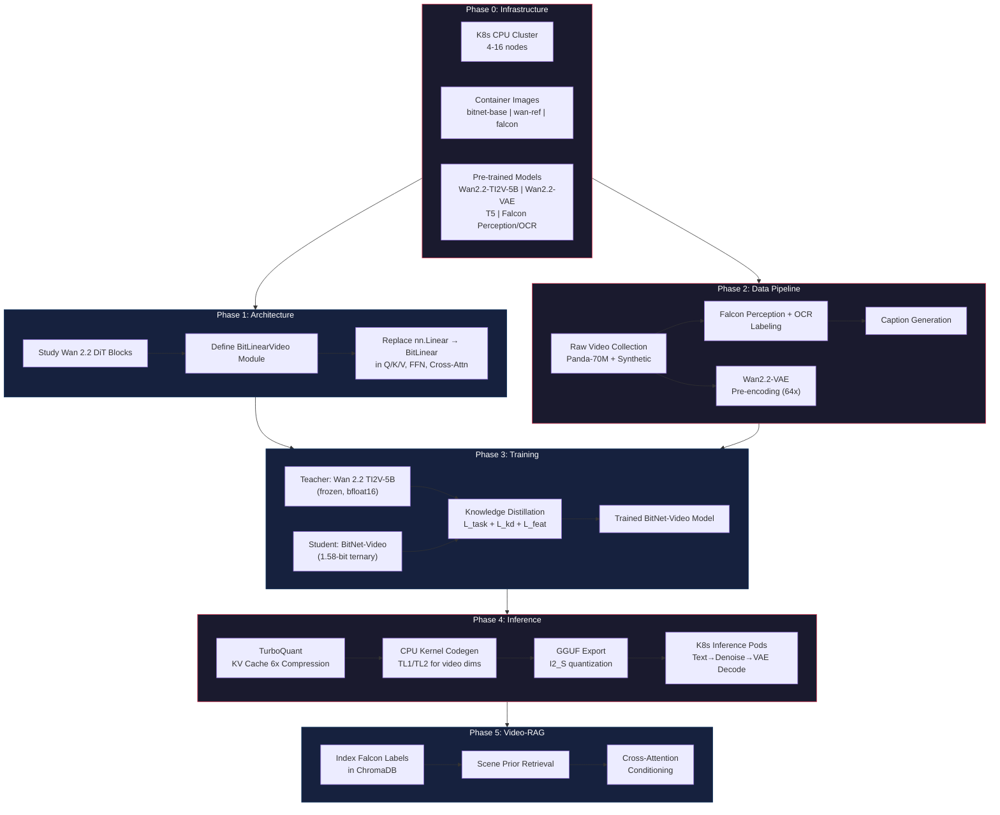
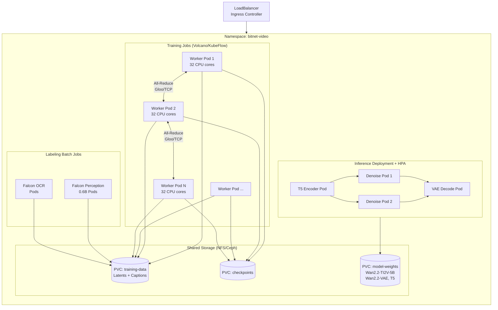
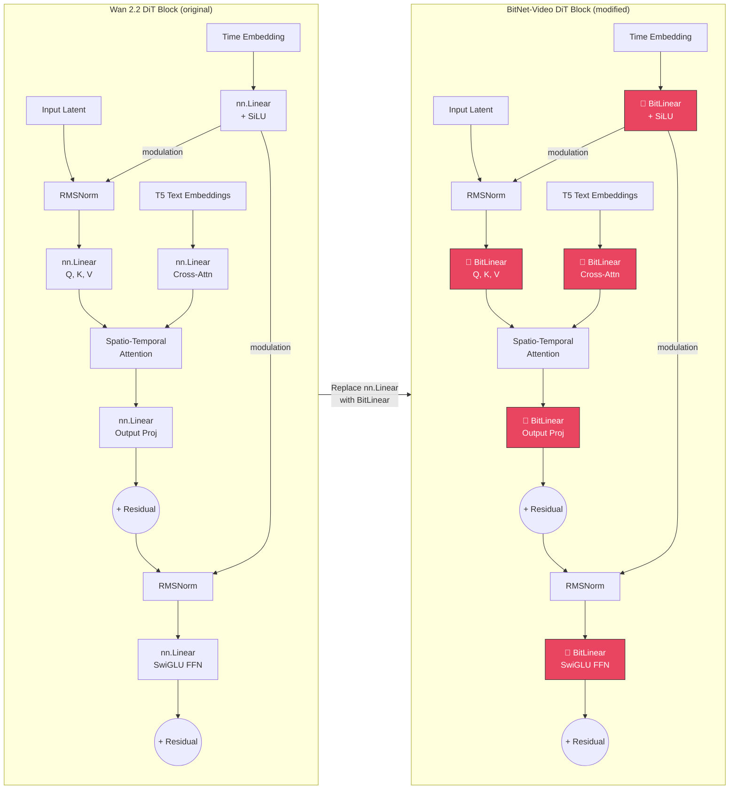
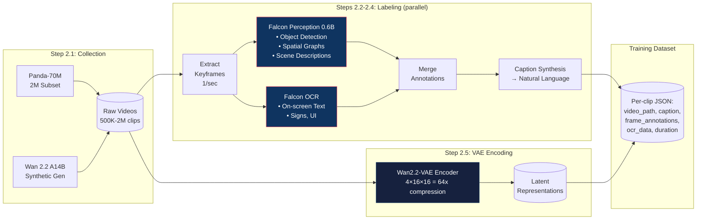
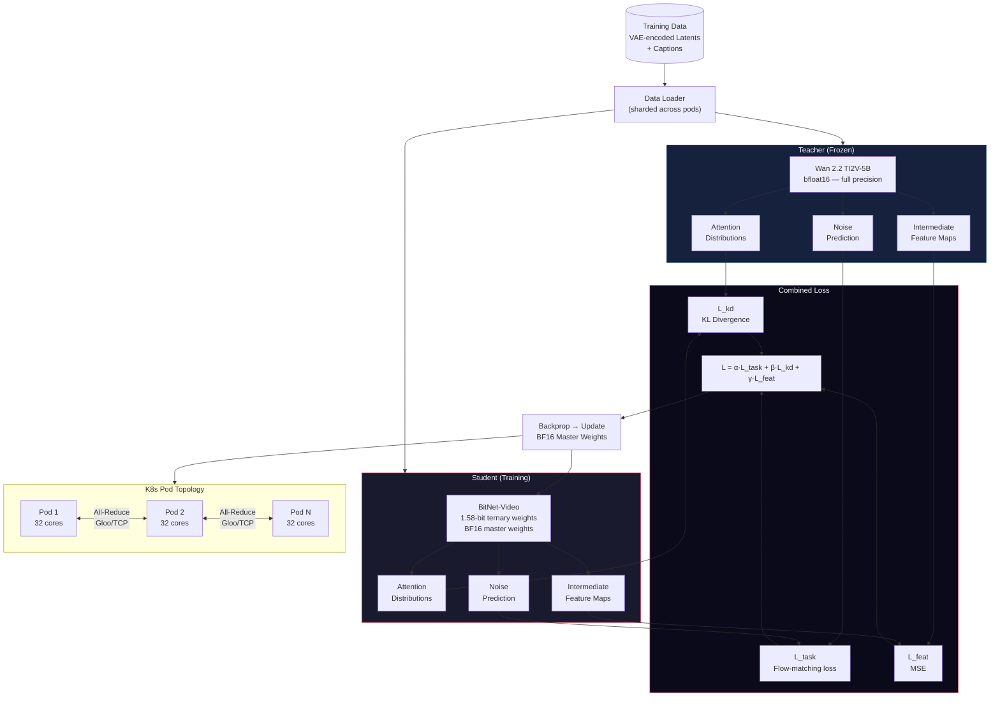
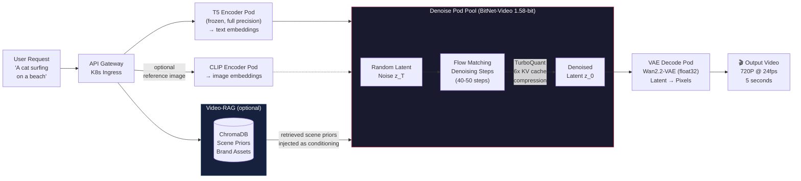
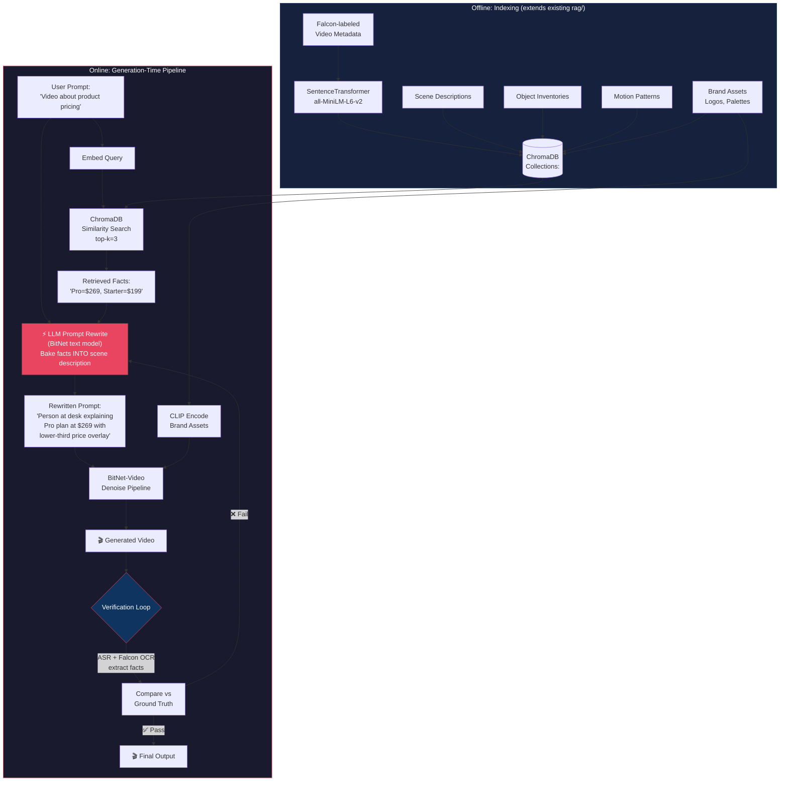

# Plan: BitNet Video Generation Model via Kubernetes CPU Cluster

## TL;DR
Build a 1.58-bit ternary video generation model by transplanting BitLinear layers into the Wan 2.2 architecture (using Wan 2.1 training recipes as reference), then deploying on a Kubernetes CPU cluster instead of GPUs. The TI2V-5B model is the primary target — smallest Wan model with the best compression ratio, already consumer-hardware-friendly. Knowledge distillation from the full-precision Wan 2.2 teacher drastically reduces training time. Falcon Perception/OCR handles automated data labeling; Video-RAG provides runtime customization without retraining.

### Project Overview



---

## Phase 0: Foundation & Infrastructure

### Step 0.1 — Kubernetes Cluster Setup
- Provision a Kubernetes cluster with CPU-optimized nodes (recommended: AMD EPYC or Intel Xeon, 64GB+ RAM per node, minimum 4 nodes)
- Create namespace `bitnet-video`, configure PersistentVolumeClaims for model weights, training data, and checkpoints
- Deploy a shared NFS or Ceph storage backend for dataset access across pods
- Install KubeFlow or Volcano scheduler for distributed training job orchestration

### Step 0.2 — Container Images
- Build a `bitnet-base` Docker image from the existing `/workspace/BitNet` repo with clang-20 and CPU-optimized kernels compiled via `setup_env.py`
- Build a `wan-reference` Docker image with Wan 2.2 source (`git clone https://github.com/Wan-Video/Wan2.2.git`) and PyTorch ≥ 2.4
- Build a `falcon-labeler` image with Falcon Perception 0.6B + Falcon OCR for data preprocessing

### Step 0.3 — Download Pre-trained Models
- `Wan-AI/Wan2.2-TI2V-5B` (primary target — 5B dense, unified T2V+I2V, 720P@24fps, Apache 2.0)
- `Wan-AI/Wan2.2-T2V-A14B` (MoE reference — 27B total / 14B active, for distillation teacher)
- Wan2.2-VAE (4×16×16 compression ratio = 64x, kept in full precision)
- T5 text encoder (kept frozen, full precision)
- Falcon Perception 0.6B + Falcon OCR from Hugging Face (TII)

### K8s Cluster Architecture



---

## Phase 1: Architecture Design — BitNet Video Transformer

### Step 1.1 — Study Wan 2.2 Transformer Blocks
- Analyze the Wan 2.2 source code at `wan/modules/` — specifically the DiT (Diffusion Transformer) blocks
- Map all `nn.Linear` layers: Q/K/V projections, output projections, cross-attention layers, FFN layers, time-embedding MLP
- Document dimensions: hidden_dim, num_heads, intermediate_size, patch_size per model size

**Reference architecture (from Wan 2.1 tech report):**

| Component | 1.3B | 5B (TI2V) | 14B |
|-----------|------|-----------|-----|
| Hidden dim | 1,536 | ~3,072 (est) | 5,120 |
| Heads | 16 | 16 | 16 |
| Layers | 12 | ~24 (est) | 40 |
| FFN dim | 8,960 | ~10,240 (est) | 13,824 |
| Patch size | 256 | 256 | 256 |

### Step 1.2 — Define BitLinear Video Module
- Create `BitLinearVideo` layer extending the existing BitLinear implementation in `gpu/model.py` (lines 60-78)
- The existing BitNet `BitLinear` does: input → int8 quantization → ternary weight matmul → dequantize
- Adapt for video: same ternary weight logic {-1, 0, 1}, but with spatio-temporal tensor shape support
- Keep the activation quantization strategy: per-token scaling to int8 via `s = 127 / max(|input|)`

### Step 1.3 — Replace Linear Layers in Wan DiT



**Replace with BitLinear (🔶 highlighted above):**
- All Q, K, V projections in self-attention (spatio-temporal)
- Output projection of attention heads
- Cross-attention linear layers (text conditioning)
- FFN up/down projections (SwiGLU gate + value projections)
- Time-embedding MLP Linear layers

**Keep in full precision (float32/bfloat16):**
- Wan2.2-VAE encoder and decoder (3D causal VAE — precision-critical for video quality)
- T5 text encoder (frozen, separate from main inference loop)
- CLIP image encoder (for I2V tasks)
- Embedding layers (patch embedding, positional encodings)
- Flow matching scheduler math (requires precise numerical computation)
- Final output projection to noise prediction

### Step 1.4 — Spatio-Temporal Attention Adaptation
- Wan 2.2 implicitly handles spatio-temporal attention within its transformer blocks
- After BitLinear replacement, verify that the Q/K/V projections still produce correct attention patterns
- The BitLinear Q/K/V outputs will be ternary-weighted but the attention scores themselves remain in float
- Add temporal position encoding support if not present in Wan's base implementation

---

## Phase 2: Data Pipeline — Falcon-Powered Labeling

### Step 2.1 — Raw Video Collection
- Download Panda-70M 2M high-quality subset via HuggingFace metadata + YouTube download scripts
- Alternatively: use Wan 2.2 A14B model to generate synthetic training videos (synthetic data approach from transcript)
- Target: minimum 500K video clips for initial training, 2M+ for convergence
- Store raw videos in shared PV on the K8s cluster

### Step 2.2 — Falcon Perception Labeling (*parallel with Step 2.1*)
- Deploy Falcon Perception 0.6B pods on K8s (CPU-friendly at 0.6B params)
- For each video: extract keyframes (1 per second), run Falcon Perception for:
  - Dense object detection + bounding boxes
  - Spatial relationship graphs ("car to the left of building")
  - Scene descriptions with Chain-of-Perception
- Output: JSON metadata per video with frame-level annotations

### Step 2.3 — Falcon OCR Pass (*parallel with Step 2.2*)
- Run Falcon OCR on same keyframes to extract:
  - On-screen text, signs, UI elements
  - Text position and bounding boxes
- Merge OCR annotations into the Falcon Perception JSON

### Step 2.4 — Caption Generation
- Combine Falcon Perception scene graphs + OCR text into rich captions
- Use the existing BitNet RAG pipeline (`rag/query.py`) with a text-generation model to synthesize natural-language captions from the structured annotations
- Output: `{video_path, caption, frame_annotations[], ocr_data[], duration, resolution}` per clip

### Step 2.5 — VAE Pre-encoding (*depends on Step 2.1*)
- Run Wan2.2-VAE encoder on all training videos to create latent representations
- Compression: 4×16×16 = 64x (Wan2.2-VAE), reducing 720P video to manageable latent tokens
- Store encoded latents in shared PV — the BitNet transformer trains on these, not raw pixels
- This is a one-time cost; the VAE is frozen thereafter

### Data Pipeline Flow



---

## Phase 3: Training — Knowledge Distillation on K8s

### Step 3.1 — Distributed Training Framework
- Use PyTorch DistributedDataParallel (DDP) with Gloo backend (CPU-native, no NCCL/GPU needed)
- Deploy as a Volcano `Job` or KubeFlow `PyTorchJob` with N worker pods
- Each worker: full model replica, processes a shard of the training data
- Gradient aggregation via All-Reduce over TCP between pods
- Checkpoint every N steps to shared PV

### Step 3.2 — Knowledge Distillation Setup
- **Teacher**: Frozen Wan 2.2 TI2V-5B (full precision, bfloat16)
- **Student**: BitNet-Video (same architecture, BitLinear layers replacing nn.Linear)
- **Distillation loss**: weighted combination of:
  - `L_task`: Standard diffusion/flow-matching loss (student prediction vs ground truth noise)
  - `L_kd`: KL divergence between teacher and student attention distributions
  - `L_feat`: MSE between teacher and student intermediate feature maps at selected layers
  - Formula: `L = α · L_task + β · L_kd + γ · L_feat`
- **Warm-start**: Initialize student model by loading Wan 2.2 TI2V-5B weights, then replace linear layers with BitLinear (weights will be "ternarized" during training via Straight-Through Estimator)

### Step 3.3 — Training Hyperparameters
- Master weights in BF16 (high precision for gradient updates), forward pass uses ternary weights
- Learning rate: 1e-4 with cosine schedule
- Batch size: scale with number of K8s worker pods (e.g., 4 pods × local batch 2 = effective batch 8)
- Training steps: ~50K-100K with distillation (vs ~500K+ from scratch)
- Gradient accumulation: 4-8 steps to compensate for small per-pod batch sizes
- Mixed-precision training: BF16 master weights, int8 activations, ternary ({-1,0,1}) forward-pass weights

### Step 3.4 — CPU Training Optimization
- Set per-pod CPU affinity: `THREADS = CPU_LIMIT - 1` matching `OMP_NUM_THREADS`
- Use Intel MKL or OpenBLAS for the teacher's full-precision computations
- The student's BitLinear forward pass uses addition/subtraction (no expensive FP matmul) — this is where BitNet's CPU advantage applies
- Pin each worker pod to specific NUMA nodes to avoid cross-socket memory access penalties

**Estimated timeline (with distillation):**

| Cluster Size | Pods × CPUs | Est. Training Time |
|---|---|---|
| Small (4 nodes) | 4 × 16 cores | ~4-8 weeks |
| Medium (8 nodes) | 8 × 32 cores | ~2-4 weeks |
| Large (16 nodes) | 16 × 32 cores | ~1-2 weeks |

*These are rough estimates. Without distillation (training from scratch), multiply by 5-10x.*

### Knowledge Distillation Architecture



---

## Phase 4: Inference Optimization

### Step 4.1 — TurboQuant KV Cache Compression
- Apply TurboQuant to compress the Key-Value cache during video generation
- Video generation is KV-cache-heavy: each frame adds tokens, long videos exhaust memory
- TurboQuant provides ~6x KV cache compression with zero accuracy loss (training-free, applied post-training)
- This allows generating longer videos (minutes vs seconds) in the same memory envelope

### Step 4.2 — BitNet CPU Kernel Integration
- Extend the existing codegen system (`utils/codegen_tl2.py` for x86, `utils/codegen_tl1.py` for ARM) to generate optimized kernels for the video model's layer dimensions
- Port the C++ lookup-table kernels (`src/ggml-bitnet-lut.cpp`, `src/ggml-bitnet-mad.cpp`) to handle the video model's specific M/K/N matrix sizes
- Update `include/kernel_config.ini` with new preset kernel configurations for video model layers

### Step 4.3 — GGUF Model Export
- Extend `utils/convert-hf-to-gguf-bitnet.py` to handle the video DiT architecture (not just text LLM)
- Export the trained BitNet-Video model as GGUF with I2_S quantization (2-bit signed ternary)
- Keep VAE and T5 encoder as separate GGUF files or in higher-precision format

### Step 4.4 — K8s Inference Deployment
- Deploy inference as a Kubernetes `Deployment` with `HorizontalPodAutoscaler`
- Each inference pod: loads full 1.58-bit model (estimated ~1-2 GB for 5B model at 1.58-bit)
- Pipeline orchestration:
  1. **Text Pod**: T5 encodes the prompt → passes text embeddings
  2. **Image Pod** (optional): CLIP encodes reference image → passes image embeddings
  3. **Denoise Pods** (multiple, parallel): Run N denoising steps across pods (pipeline parallelism by timestep, or data parallelism for batch requests)
  4. **VAE Decode Pod**: Wan2.2-VAE decodes latents → outputs video
- Load balancer distributes generation requests across pod replicas

### Inference Pipeline



---

## Phase 5: Video-RAG Runtime Enhancement

> **Key insight** ([source](https://www.reddit.com/r/Rag/comments/1psy4g0/lessons_from_integrating_rag_with_ai_video/)): Video models ignore appended RAG context — they are trained on scene descriptions, not fact extraction. Appending retrieved chunks to the prompt causes hallucination. The fix is an **LLM prompt rewrite step** that bakes retrieved facts directly into the scene description before the video model sees it.

### Step 5.1 — Extend Existing RAG Pipeline
- Build on the existing `rag/index_data.py` and `rag/query.py` infrastructure
- Add video-specific indexing: store per-video metadata from Falcon labels (Step 2.2-2.3) in ChromaDB
- New document types: scene descriptions, object inventories, motion patterns, style tags

### Step 5.2 — LLM Prompt Rewrite Step (critical)
Video generation models do **not** reason over appended context the way LLMs do. Raw context injection fails silently — the model generates plausible-looking but factually wrong video.

**Pattern: LLM-mediated prompt rewriting**
1. User submits a generation prompt (e.g., *"Video of a person explaining our product pricing"*)
2. RAG retrieves relevant facts from ChromaDB (e.g., *"Pro plan is $269, Starter is $199"*)
3. An LLM (BitNet text model or external) **rewrites** the prompt with facts baked into the scene description:
   - Before: *"Video of a person explaining our product pricing"*
   - After: *"Video of a person looking at the camera saying the Pro plan costs $269 and the Starter plan costs $199, with on-screen lower-third text showing both prices"*
4. The rewritten prompt — not the raw context — is sent to the video generation model

**Why this works**: The video model treats the entire prompt as a scene description. Facts embedded in scene language ("a sign reading $269") are rendered; facts appended as data ("Context: price=$269") are ignored.

### Step 5.3 — Make Facts Renderable
Bind retrieved facts to visually grounded elements to maximize adherence:
- **On-screen text**: *"lower-third text overlay showing: Complete $269"*
- **Props**: *"a pricing chart on the whiteboard behind the speaker"*
- **Structured micro-specs**: Have the rewrite LLM output a constrained schema:
  ```json
  {
    "scene_description": "person explaining pricing at a desk",
    "on_screen_text": ["Pro: $269", "Starter: $199"],
    "props": ["pricing_chart", "product_box"],
    "spoken_facts": ["Pro plan costs $269", "Starter costs $199"]
  }
  ```
- This reduces degrees of freedom and lowers the hallucination rate

### Step 5.4 — Verification Loop
For factual accuracy (pricing, legal claims, brand names), add a post-generation verification step:
1. Run **ASR** (speech-to-text) on the generated video audio
2. Run **Falcon OCR** on rendered frames to extract on-screen text
3. Compare extracted facts against the original RAG-retrieved ground truth
4. If verification fails → regenerate with a more constrained rewrite
5. Log pass/fail rates to track factual accuracy over time

This automated check is essential because even a small hallucination rate is unacceptable for pricing, legal, or brand-critical content.

### Step 5.5 — Brand/Asset Injection
- Store brand assets (logos, color palettes, character reference images) in the RAG vector store
- At inference, retrieved brand assets are fed through the CLIP image encoder and injected as additional conditioning
- Uses V-RAG pattern: retrieval → encode → condition → generate

### Video-RAG Flow



---

## Relevant Files

### Existing BitNet (to modify/extend)
- `gpu/model.py` — `BitLinear` and `BitLinearKernel` implementations (lines 60-78), `TransformerBlock` architecture, `Attention` with GQA
- `src/ggml-bitnet-lut.cpp` — C++ LUT kernels for ARM inference
- `src/ggml-bitnet-mad.cpp` — C++ multiply-add kernels for x86 inference
- `include/bitnet-lut-kernels.h` — Generated kernel headers
- `include/gemm-config.h` — `PARALLEL_SIZE`, `ROW_BLOCK_SIZE`, `COL_BLOCK_SIZE` tuning parameters
- `include/kernel_config.ini` — Preset kernel configurations per layer size
- `utils/codegen_tl1.py` — ARM kernel code generation
- `utils/codegen_tl2.py` — x86 kernel code generation (BM, BK, bm parameters)
- `utils/convert-hf-to-gguf-bitnet.py` — HF→GGUF conversion for BitNet models
- `setup_env.py` — Build pipeline: `setup_gguf()` → `gen_code()` → `compile()` → `prepare_model()`
- `run_inference_server.py` — HTTP server (llama-server wrapper), template for video inference API
- `rag/index_data.py` — Document ingester (JSON, JSONL, CSV, MD, TXT, directory scanning)
- `rag/query.py` — RAG query interface with ChromaDB retrieval + BitNet server integration

### New Files to Create
- `video/model.py` — BitNet-Video transformer definition (BitLinear DiT blocks)
- `video/train.py` — Knowledge distillation training loop
- `video/generate.py` — Video generation pipeline (text → denoise → VAE decode)
- `video/data_pipeline.py` — Falcon-based video labeling orchestrator
- `video/vae_encode.py` — Wan2.2-VAE pre-encoding script
- `video/requirements.txt` — PyTorch, diffusers, xformers, sentence-transformers, etc.
- `k8s/` — Kubernetes manifests (Deployments, Jobs, PVCs, ConfigMaps)
- `k8s/training-job.yaml` — PyTorchJob/Volcano Job for distributed distillation
- `k8s/inference-deployment.yaml` — Inference pods with HPA
- `k8s/labeling-job.yaml` — Falcon labeling batch job
- `video/turboquant.py` — TurboQuant KV cache compression integration

### External Repos to Reference
- `https://github.com/Wan-Video/Wan2.2` — Primary architecture reference (MoE, TI2V-5B, Wan2.2-VAE)
- `https://github.com/Wan-Video/Wan2.1` — Training recipes, Wan-VAE docs, technical report
- `https://huggingface.co/tiiuae/Falcon3-Perception-0.6B` — Data labeling model
- `https://huggingface.co/tiiuae/Falcon3-OCR-0.6B` — OCR labeling model

---

## Verification

1. **Unit test BitLinear replacement**: Replace a single Wan DiT block with BitLinear, run a forward pass with random latent tensors, verify output shape matches original
2. **VAE roundtrip**: Encode a test video with Wan2.2-VAE → decode → verify visual quality preserved
3. **Distillation convergence**: Monitor `L_task`, `L_kd`, `L_feat` losses — all should decrease monotonically over first 10K steps
4. **Single-pod inference**: Generate a 5-second 480P test video on a single CPU pod, verify it produces coherent motion
5. **K8s scaling**: Run inference benchmark with 1, 2, 4, 8 pods — verify throughput scales sub-linearly
6. **Video-RAG retrieval**: Index 100 Falcon-labeled video descriptions, query with "a car on a highway" → verify relevant scenes retrieved
7. **Memory footprint**: Confirm 5B BitNet-Video model loads in <2GB RAM (1.58-bit weight compression)
8. **TurboQuant**: Compare max video length with/without KV cache compression — expect ~6x improvement

---

## Decisions

- **Model size**: Target Wan 2.2 TI2V-5B (5B dense) rather than 14B MoE — smaller model is better suited for CPU inference and training
- **Wan version**: Use Wan 2.2 models/architecture with Wan 2.1 training recipes/documentation as reference
- **No GPU**: All training and inference on CPU via K8s — leveraging BitNet's multiplication-free advantage on CPU
- **Distillation over scratch**: Use knowledge distillation from full-precision Wan 2.2 teacher, not training from scratch (~5-10x faster)
- **VAE kept full-precision**: Wan2.2-VAE remains in float32/bfloat16 — video quality degrades badly with ternary VAE weights
- **Apache 2.0**: Both BitNet and Wan use Apache 2.0 — commercially usable

## Further Considerations

1. **5B vs 1.3B target**: The 5B model offers 720P@24fps but requires more training compute. Starting with the Wan 2.1 1.3B model for proof-of-concept (480P) and scaling to 5B once validated could reduce risk. **Recommendation: Start with 1.3B proof-of-concept, then scale to 5B.**
2. **Synthetic vs real data**: Generating training data with the Wan 2.2 A14B teacher model avoids Panda-70M download/broken-link issues, but adds generation cost. **Recommendation: Mix — use 500K synthetic + available real data from Panda-70M 2M subset.**
3. **Kubernetes node spec**: The minimum viable cluster for training is ~4 nodes × 32 cores × 64GB RAM. Going smaller will make training impractically slow. **Recommendation: Budget for 8 nodes minimum for reasonable training timelines (~2-4 weeks).**
