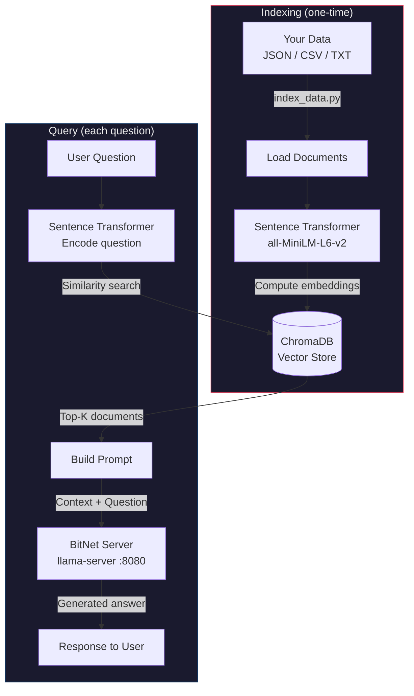

# BitNet RAG Pipeline

Retrieval-Augmented Generation using BitNet for CPU-friendly Q&A over your own data.

## How It Works



## Setup

```bash
pip install -r rag/requirements.txt
```

## Index Your Data

Supports JSON, JSONL, CSV, and TXT files.

```bash
# Sample data
python rag/index_data.py rag/sample_data.json

# Your own data
python rag/index_data.py /path/to/your/data.csv
```

Options:
```
python rag/index_data.py <data_path> [--collection NAME] [--db-path PATH] [--embedding-model MODEL] [--batch-size N]
```

## Query

### Start the BitNet server (Terminal 1)
```bash
python run_inference_server.py -m models/BitNet-b1.58-2B-4T/ggml-model-i2_s.gguf -n 512
```

### Interactive mode (Terminal 2)
```bash
python rag/query.py
```

### Single question
```bash
python rag/query.py -q "How much horsepower does a Saab 9000 have?"
```

### All query options
```
python rag/query.py [-q QUERY] [--server-url URL] [--collection NAME] [--db-path PATH] [--embedding-model MODEL] [--top-k N] [--max-tokens N] [--temperature T]
```

| Option | Default | Description |
|---|---|---|
| `-q` | *(interactive)* | Single question to ask |
| `--server-url` | `http://127.0.0.1:8080` | BitNet server URL |
| `--collection` | `bitnet_rag` | ChromaDB collection name |
| `--db-path` | `rag/chroma_db` | ChromaDB storage path |
| `--top-k` | `3` | Number of documents to retrieve |
| `--max-tokens` | `512` | Max tokens for response |
| `--temperature` | `0.3` | Generation temperature |

## Data Formats

**JSON** — array of objects with `text` or `content` field:
```json
[{"text": "Your document here."}, {"text": "Another document."}]
```

**JSONL** — one JSON object per line:
```
{"text": "Your document here."}
{"text": "Another document."}
```

**CSV** — with `text` or `content` column:
```
text
"Your document here."
"Another document."
```

**TXT** — one document per line:
```
Your document here.
Another document.
```
