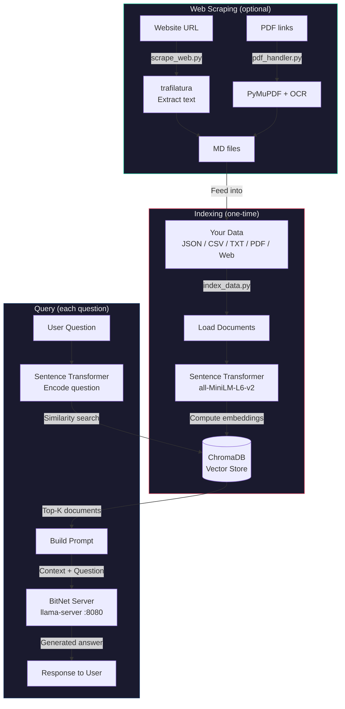
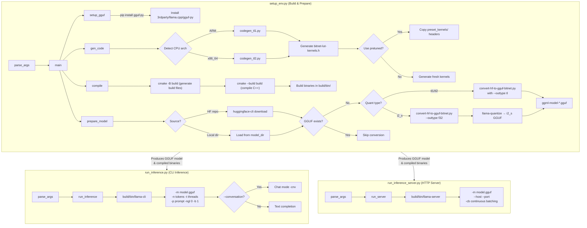

# BitNet RAG Pipeline

Retrieval-Augmented Generation using BitNet for CPU-friendly Q&A over your own data.

## How It Works



## Setup

```bash
pip install -r rag/requirements.txt
```

## Index Your Data

Supports JSON, JSONL, CSV, TXT, MD, and PDF files. Can also index a directory of files.

```bash
# Index a directory of files
python rag/index_data.py rag/sampling_data

# Or a single file
python rag/index_data.py rag/sampling_data.json

# Your own data
python rag/index_data.py /path/to/your/data.csv
```

Options:
```
python rag/index_data.py <data_path> [--collection NAME] [--db-path PATH] [--embedding-model MODEL] [--batch-size N] [--workers N] [--chroma-server URL]
```

| Option | Default | Description |
|---|---|---|
| `--collection` | `bitnet_rag` | ChromaDB collection name |
| `--db-path` | `rag/chroma_db` | Path to store local ChromaDB |
| `--embedding-model` | `all-MiniLM-L6-v2` | Sentence transformer model |
| `--batch-size` | `100` | Documents per indexing batch |
| `--workers` | `1` | Parallel workers for file loading/OCR |
| `--chroma-server` | `http://localhost:8000` | ChromaDB server URL (auto-falls back to local `--db-path` if unreachable) |

**Multi-node indexing:** Run a [ChromaDB server](https://docs.trychroma.com/docs/run-chroma/chroma-server) on a shared host — all tools auto-connect to `localhost:8000` by default:
```bash
# Start ChromaDB server (once)
chroma run --host 0.0.0.0 --port 8000

# On each node — no extra flags needed
python rag/index_data.py /local/data --workers 4

# Or override for a remote server
python rag/index_data.py /local/data --chroma-server http://chroma-host:8000
```

If no server is running, both `index_data.py` and `query.py` automatically fall back to local storage at `--db-path`.

## Scrape a Website

Crawl a website and extract content as MD files, then index them.
PDF links found during crawling are automatically downloaded and OCR'd.

```bash
# Scrape a single page
python rag/scrape_web.py https://www.saabnet.com/tsn/faq/c900.html

# Crawl a section (follows links up to depth 2)
python rag/scrape_web.py https://www.saabnet.com/tsn/faq/ --crawl --max-pages 50

# Multiple sites in parallel (one thread per domain)
python rag/scrape_web.py https://www.saabnet.com/tsn/faq/ https://www.saabplanet.com/tech/ --crawl --workers 2

# Then index the scraped data
python rag/index_data.py rag/sampling_data
```

Options:
```
python rag/scrape_web.py <url> [url2 ...] [-o OUTPUT_DIR] [--crawl] [--max-depth N] [--max-pages N] [--delay SECS] [--workers N]
```

| Option | Default | Description |
|---|---|---|
| `-o` | `rag/sampling_data` | Output directory for scraped files |
| `--crawl` | off | Follow links from the start URL |
| `--max-depth` | `2` | Max link depth when crawling |
| `--max-pages` | `50` | Max pages to scrape per URL |
| `--delay` | `1.0` | Seconds between requests (be polite) |
| `--force` | off | Re-download files even if they already exist |
| `--workers` | `1` | Parallel workers for multi-URL scraping |

The scraper respects `robots.txt` and identifies itself as `BitNet-RAG-Scraper`.

## Process PDFs

Extract text from PDFs using PyMuPDF with automatic OCR fallback for scanned pages.

```bash
# Single PDF
python rag/pdf_handler.py manual.pdf -o rag/sampling_data/

# Directory of PDFs
python rag/pdf_handler.py /path/to/pdfs/ -o rag/sampling_data/

# PDFs in sampling_data are also auto-detected by index_data.py
python rag/index_data.py rag/sampling_data
```

PDFs are handled three ways:
1. **Standalone** — `pdf_handler.py` converts PDFs to MD files
2. **During indexing** — `index_data.py` auto-detects `.pdf` files in directories
3. **During scraping** — `scrape_web.py` downloads and processes PDF links found on pages

## Query

### Start the BitNet server (Terminal 1)
```bash
python run_inference_server.py -m models/BitNet-b1.58-2B-4T/ggml-model-i2_s.gguf -n 512
```

### Interactive mode (Terminal 2)
```bash
python rag/query.py
```

### Single question
```bash
python rag/query.py -q "How much horsepower does a Saab 9000 have?"
```

### All query options
```
python rag/query.py [-q QUERY] [--server-url URL] [--collection NAME] [--db-path PATH] [--embedding-model MODEL] [--top-k N] [--max-tokens N] [--temperature T]
```

| Option | Default | Description |
|---|---|---|
| `-q` | *(interactive)* | Single question to ask |
| `--server-url` | `http://127.0.0.1:8080` | BitNet server URL |
| `--collection` | `bitnet_rag` | ChromaDB collection name |
| `--db-path` | `rag/chroma_db` | Local ChromaDB fallback path |
| `--chroma-server` | `http://localhost:8000` | ChromaDB server URL (auto-falls back to local) |
| `--top-k` | `3` | Number of documents to retrieve |
| `--max-tokens` | `512` | Max tokens for response |
| `--temperature` | `0.3` | Generation temperature |

## Data Formats

**JSON** — array of objects with `text` or `content` field:
```json
[{"text": "Your document here."}, {"text": "Another document."}]
```

**JSONL** — one JSON object per line:
```
{"text": "Your document here."}
{"text": "Another document."}
```

**CSV** — with `text` or `content` column:
```
text
"Your document here."
"Another document."
```

**TXT** — one document per line:
```
Your document here.
Another document.
```

**PDF** — text PDFs are extracted directly; scanned PDFs are OCR'd automatically.

System dependencies for PDF/OCR:
```bash
apt-get install tesseract-ocr poppler-utils
```


## Reference

Non-RAG flow

